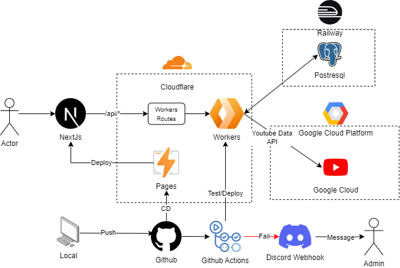
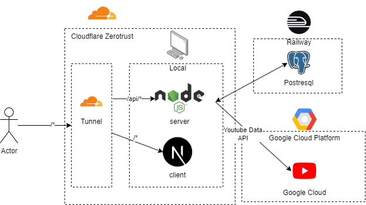
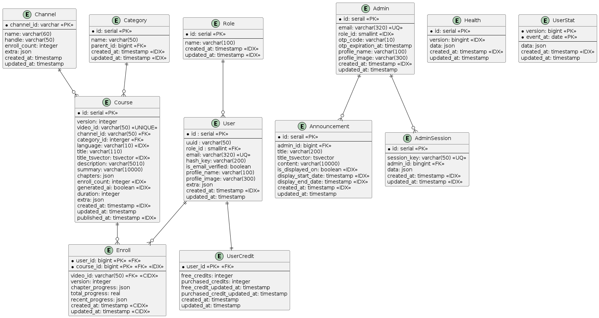
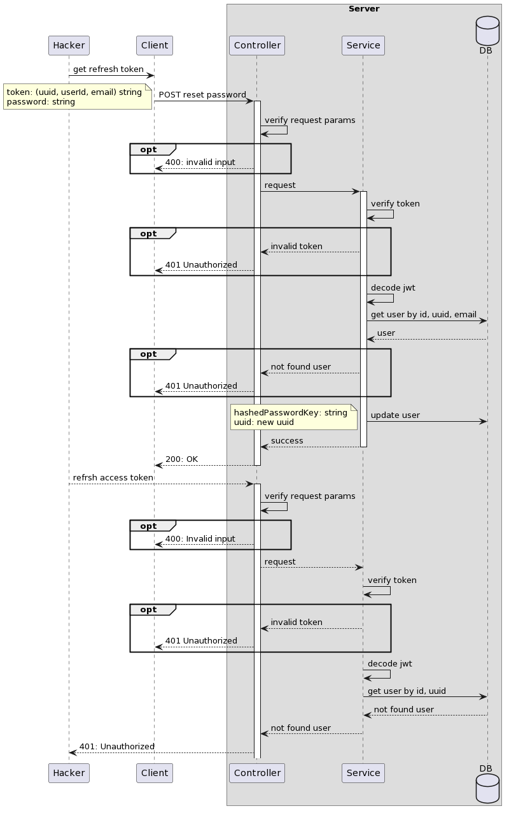

# 오픈 플레이리스트
## 개요
유튜브에 긴 강의 영상을 챕터별로 관리할수 있는 웹앱
## 링크
https://openplaylist.net
## 기술스택
### 백엔드
- NodeJs, TypeScript 
- mysql, postgresql
### 프론트
- TypeScript
- NextJs, React
### 배포 / 라이브러리
#### 백엔드
- 배포
  - cloudflare worker
  - github actions
- 라이브러리
  - Jest
  - Drizzle ORM
  - Prisma
  - Zod
  - YouTube Data API
#### 프론트
- 배포
  - cloudflare pages
- 라이브러리
  - Tailwind CSS
  - Shadcn ui
  - Zustand
  - Immer
  - Axios
  - Zod
## 아키텍쳐
### production / dev

### local 

## ERD

## 문제해결
### Access 또는 Refresh 토큰 탈취시 대응 방안
#### 문제점
- 토큰 탈취를 당한경우 유효 기간동안 authorization이 가능하기 때문에 취약함
- session을 통해서 지속적으로 authorization을 하게되면 db에 부담이 생길 수 있음
#### 해결방안
- user db에 uuid 필드를 추가
	- uuid는 전체 user에서 고유할 필요는 없음
- refresh token 발행시 payload에 user 정보와 uuid를 포함시킴
- access 토큰 만료기간을 매우 짧게 설정하거나 memory에만 저장 하여 refresh token을 자주 사용하도록 강제
- 사용자가 reset password 경우 처럼 authorization을 만료 행위를 할때 기존 user db의 uuid를 새로 발급 받음
- access 토큰을 refresh 토큰으로 재발행 할때 user db의 uuid와 token payload의 uuid와 비교 후 일치 하지 않으면 access 토큰 발급 거부
#### 장점
- 토큰이 탈취 되더라도 사용자의 행위에 따라 refresh token 만료을 할 수 있음
- access token은 기간을 짧게 가져가서 보안에 덜취약함
- access 토큰의 사용기간이 짧더라도 session 방식보다는 db 부담은 적음
#### diagram

## 기능
### /courses
- create course by youtube video
- enroll course
- search course by youtube url
- order courser by create, recent, popular
### /channels
- get courses by channel
- order courser by create, recent, popular
### /me
- update profile
- get enrolls
- get credit
### /watch
- watch enroll course
- complete chapter
- auto update recent watch course
- watch custom course

## Docs
- [IA](./docs/IA.md)
- [FlowChart](./docs/FlowChart.md)
- [WBS](./docs/WBS.md)
- [History](./docs/History.md)
- [ERD](./docs/ERD.md)