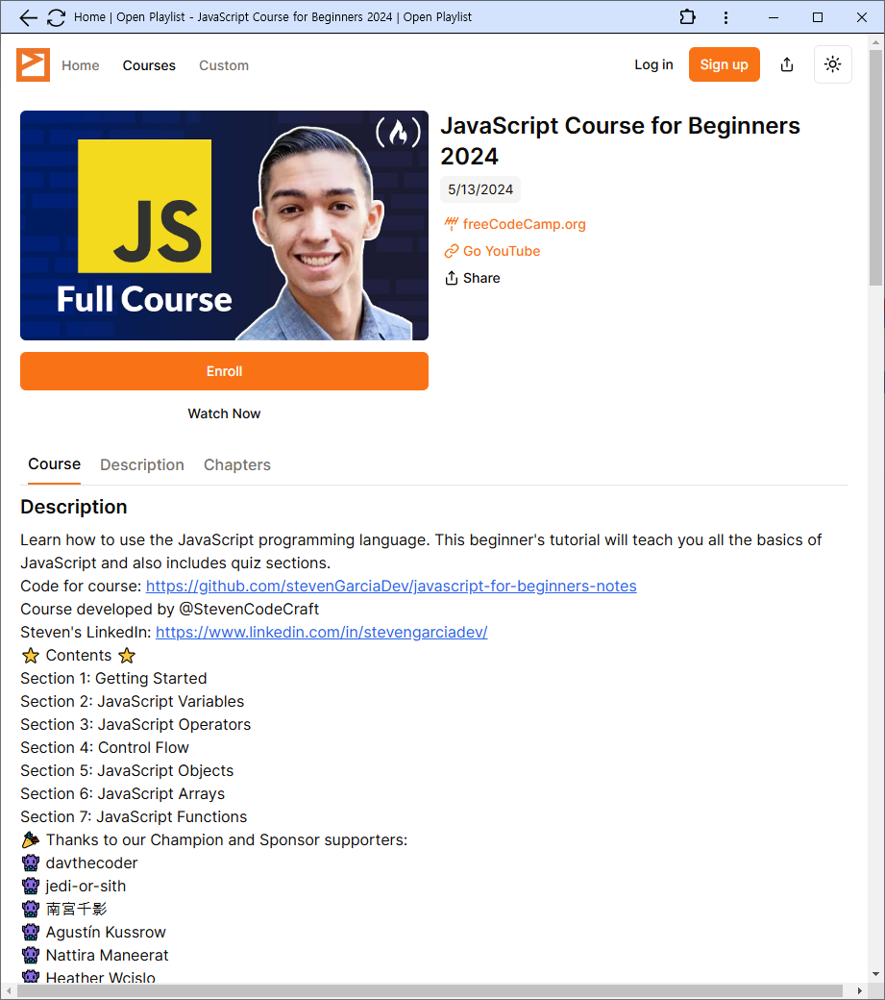
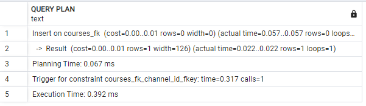
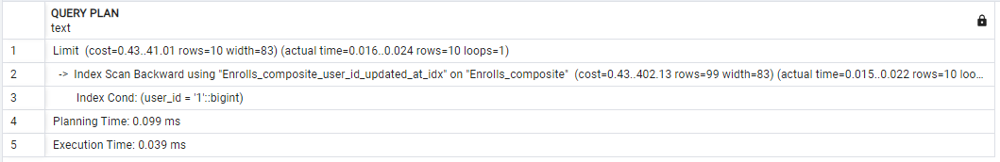

# Open Playlist <!-- omit from toc -->

유튜브에는 수많은 강의 영상이 있습니다. 짧게는 1시간 길게는 100시간이 되는 강의도 존재합니다. 강의 시간이 길기 때문에 장시간을 온전히 집중 할 수 없고 또한 내가 어느 부분을 들었는지 확인할 수 가 없습니다.

**OpenPlaylist** 이러한 문제점을 해결하기 위해 제작되었습니다.

누구나 유튜브 영상을 강의처럼 만들 수 있으며 쉽게 내가 어느 부분을 들었는지 챕터별로 확인 할 수 있습니다.

- 개인프로젝트

## 기간

- 백엔드
  - `2024-02` ~ `2024-04`
- 프론트
  - `2024-04` ~ `2024-05`

## 링크

- https://openplaylist.net/

## 기술스택

### 백엔드

### 인프라

### 프론트

## 아키텍쳐

### 인프라

#### Production

#### Development

### CI / CD

## ERD

## 목차 <!-- omit from toc -->

- [기간](#기간)
- [링크](#링크)
- [기술스택](#기술스택)
	- [백엔드](#백엔드)
	- [인프라](#인프라)
	- [프론트](#프론트)
- [아키텍쳐](#아키텍쳐)
	- [인프라](#인프라-1)
	- [CI / CD](#ci--cd)
- [ERD](#erd)
- [기능](#기능)
- [DB 설계](#db-설계)
	- [FK 제약](#fk-제약)
	- [복합 Index](#복합-index)
- [보안](#보안)
	- [토큰 탈취 전략](#토큰-탈취-전략)
- [비지니스 로직](#비지니스-로직)
	- [YouTube Data API 제한 전략](#youtube-data-api-제한-전략)
- [프로젝트](#프로젝트)
	- [클린 아키텍쳐](#클린-아키텍쳐)

## 기능

- Auth
  - 이메일 회원가입, 이메일 인증, 로그아웃, 탈퇴, 비밀번호 찾기
- Course
  - 생성, 등록, 검색
- Channel
  - 조회
- Me
  - Profile
    - 업데이트
  - Credit
    - 조회, 무료 크레딧 생성
  - Enroll
    - 생성, 조회, 업데이트
- Announcement
  - 조회

|                       Main                       |                   Course List                    |
| :----------------------------------------------: | :----------------------------------------------: |
|  |  |
|                      Course                      |                     Channel                      |
|  |  |
|                     Enrolls                      |                      Watch                       |
|  |  |
|                      Credit                      |                     Account                      |
|  |  |
|                     Profile                      |                   Announcement                   |
|  |  |

## DB 설계

### FK 제약

#### 문제점

- 사용자가 쉽게 유튜브 영상을 기반으로 course가 생성 가능하며 많은 양의 course가 생성될 가능성이 있는 환경임
- 한번 생성시 사용자가 course나 channel을 삭제할 수 없는 구조임
- channel과 course는 1:M 관계로 `foreign key` 제약 조건이 걸려 있다면 course 생성시 channel_id를 확인하는 과정이 거치기 때문에 Insert에 성능상 불리함

#### 해결

- course 테이블에 channel_id `foreign key`를 사용하지 않고 course 생성

#### 테스트

- 환경
  - 2만 channel rows
  - 각 채널당 300개 course
- query
  - `EXPLAIN ANALYZE INSERT INTO courses_fk (channel_id, title) VALUES (2, 'title')`

##### 결과

- 5배 빠르게 쿼리 수행

| FK     | Execution Time |
| ------ | -------------- |
| 적용   | 0.392 ms       |
| 미적용 | 0.078 ms       |

##### Explain

`foreign key 제약 있는경우`

`foreign key 제약 없이 index`

### 복합 Index

#### 문제점

- enrolls 테이블의 조회는 `user_id`에 제한접 접근 가능한 테이블임
- 기본 쿼리가 `update_at` desc order로 정렬 되어 조회됨
- 기존 테이블에서 `update_at`에 추가적으로 index를 생성한 경우라도 `user_id` 조건 order by `update_at` 조회하게 되면 index 활용되지 못해 성능상 조회 성능이 떨어짐

#### 해결

- `user_id`와 `updated_at`을 하나로 묶어 `composite index`를 설정하여 order 조회에 성능 향상시킴

#### 테스트

- 환경
  - 유저: 100,000
  - 회원당 enroll: 100
  - 총 10,000,000 ROWS
- query
  - `EXPLAIN ANALYZE SELECT * FROM "Enrolls" WHERE user_id = '1' ORDER BY updated_at DESC LIMIT 10;`

#### 결과

- 3.5배 빠르게 쿼리 수행 가능

| index                    | Execution Time |
| ------------------------ | -------------- |
| `user_id`, `updated_at`  | 0.137 ms       |
| `user_id` & `updated_at` | 0.039 ms       |

##### Explain

###### `updated_at`

###### `user_id` & `updated_at`

## 보안

### 토큰 탈취 전략

#### 문제점

- JWT 인가의 방식에서 토큰 탈취를 당한경우 유효 기간동안 인가가 가능하기 때문에 취약함
- session db 방법으로 지속적으로 인가를 하게되면 db에 부담이 생길 수 있음

#### 해결

- user db에 uuid 필드를 추가
  - uuid는 전체 user에서 고유할 필요는 없음
- refresh token 발행시 payload에 user 정보와 uuid를 포함시킴
- access 토큰 만료기간을 매우 짧게 설정하거나 memory에만 저장 하여 refresh token을 자주 사용하도록 강제
- 사용자가 reset password 경우 처럼 authorization을 만료 행위를 할때 기존 user db의 uuid를 새로 발급 받음
- access 토큰을 refresh 토큰으로 재발행 할때 user db의 uuid와 token payload의 uuid와 비교 후 일치 하지 않으면 access 토큰 발급 거부

#### 장점

- 토큰이 탈취 되더라도 사용자의 행위에 따라 refresh token 만료을 할 수 있음
- access token은 기간을 짧게 가져가서 보안에 덜취약함
- access 토큰의 사용기간이 짧더라도 session 방식보다는 db 부담은 적음

#### 다이어그램

## 비지니스 로직

### YouTube Data API 제한 전략

#### 문제점

- Youtube URL을 통해서 사용자 누구나 제한없이 course를 생성 가능
- Course를 생성할 때마다 Youtube Data API를 사용하기 때문에 과도한 요청이 발생 할 수 있음

#### 해결

- 사용자별 Credit을 추가하여 course 생성시 credit을 소모하여 생성하도록 로직 구성
- 매일 무료 Credit을 제공하여 지속적인 course 생성 가능하도록 구성

#### 다이어 그램

## 프로젝트

### 클린 아키텍쳐

- 프레임워크를 사용하지 않고 class 기반으로 의존성을 고려하여 코드 설계
  - 싱글톤
  - 의존성 주입(DI) 설계
  - 추상계층 설계를 통한 의존 관계 역전
- 레이어별 역할
  - middleware
    - auth 처리
  - controller
    - input validate 처리
    - output validate 처리
    - end point처리, global exception 처리
  - service
    - infrastructure(의존 관계 클래스)에 대한 interface를 만들어 DI로 주입하여 의존 관계 역전 구현
    - 비지니스 로직처리
    - 오류 case에 따른 exception 처리
  - domain
    - domain 데이터 관련하여 로직을 처리
  - infrastructure
    - repository
    - etc
