## 주의사항
**초기 설계에 사용했던 다이어그램으로 실제 code 구현과 다소 차이가 있을수 있습니다.**
## Table of Contents
- [주의사항](#주의사항)
- [Table of Contents](#table-of-contents)
- [/auth](#auth)
	- [POST /auth/sign-up](#post-authsign-up)
		- [request](#request)
		- [diagram](#diagram)
	- [POST /auth/resend-verification-email](#post-authresend-verification-email)
		- [request](#request-1)
		- [response](#response)
		- [diagram](#diagram-1)
	- [GET /auth/verify-access-token](#get-authverify-access-token)
		- [request](#request-2)
		- [response](#response-1)
		- [diagram](#diagram-2)
	- [GET /auth/refresh-access-token](#get-authrefresh-access-token)
		- [request](#request-3)
		- [diagram](#diagram-3)
	- [GET /auth/verify-email](#get-authverify-email)
		- [request](#request-4)
		- [diagram](#diagram-4)
	- [POST /auth/sign-in](#post-authsign-in)
		- [request](#request-5)
		- [response](#response-2)
		- [diagram](#diagram-5)
	- [POST /auth/find-password](#post-authfind-password)
		- [request](#request-6)
		- [reponse](#reponse)
		- [diagram](#diagram-6)
- [/me](#me)
	- [PATCH /me/profile](#patch-meprofile)
		- [request](#request-7)
		- [diagram](#diagram-7)
	- [GET /me/enrolls?](#get-meenrolls)
		- [request](#request-8)
		- [reponse](#reponse-1)
		- [diagram](#diagram-8)
	- [GET /me/enrolls/courses/:curseId](#get-meenrollscoursescurseid)
		- [request](#request-9)
		- [reponse](#reponse-2)
		- [diagram](#diagram-9)
	- [POST /me/enrolls](#post-meenrolls)
		- [request](#request-10)
		- [diagram](#diagram-10)
- [/courses](#courses)
	- [GET /courses/:id/:slug](#get-coursesidslug)
		- [request](#request-11)
		- [response](#response-3)
		- [diagram](#diagram-11)
	- [POST /courses](#post-courses)
		- [request](#request-12)
		- [diagram](#diagram-12)
	- [GET /courses?](#get-courses)
		- [request](#request-13)
		- [reponse](#reponse-3)
		- [diagram](#diagram-13)
- [/channels](#channels)
	- [GET /channels/:id](#get-channelsid)
		- [request](#request-14)
		- [response](#response-4)
		- [diagram](#diagram-14)
- [/admin](#admin)
	- [/users](#users)
		- [GET /admin/users/statics](#get-adminusersstatics)
		- [GET /admin/users?](#get-adminusers)
		- [GET /admin/users/:id](#get-adminusersid)
		- [PATCH /admin/users/:id](#patch-adminusersid)
		- [DELETE /admin/users/:id](#delete-adminusersid)
	- [/courses](#courses-1)
		- [GET /admin/courses/statics](#get-admincoursesstatics)
		- [GET /admin/courses?](#get-admincourses)
		- [GET /admin/courses/:id](#get-admincoursesid)
		- [PATCH /admin/courses/:id](#patch-admincoursesid)
		- [DELETE /admin/courses/:id](#delete-admincoursesid)
	- [/channels](#channels-1)
		- [GET /admin/channels/statics](#get-adminchannelsstatics)
		- [GET /admin/channels?](#get-adminchannels)
		- [GET /admin/channels/:id](#get-adminchannelsid)
		- [PATCH /admin/channels/:id](#patch-adminchannelsid)
		- [DELETE /admin/channels/:id](#delete-adminchannelsid)
	- [/categorys](#categorys)
		- [GET /admin/categorys?](#get-admincategorys)
		- [GET /admin/categorys/:id](#get-admincategorysid)
		- [PATCH /admin/categorys/:id](#patch-admincategorysid)
		- [DELETE /admin/categorys/:id](#delete-admincategorysid)
	- [/roles](#roles)
		- [GET /admin/roles?](#get-adminroles)
		- [GET /admin/roles/:id](#get-adminrolesid)
		- [PATCH /admin/roles/:id](#patch-adminrolesid)
		- [DELETE /admin/roles/:id](#delete-adminrolesid)

## /auth
### POST /auth/sign-up
#### request
```ts
type RequestAuthSignUpBody = {
	userName: string,
	email: string,
	password: string,
}
```
#### diagram
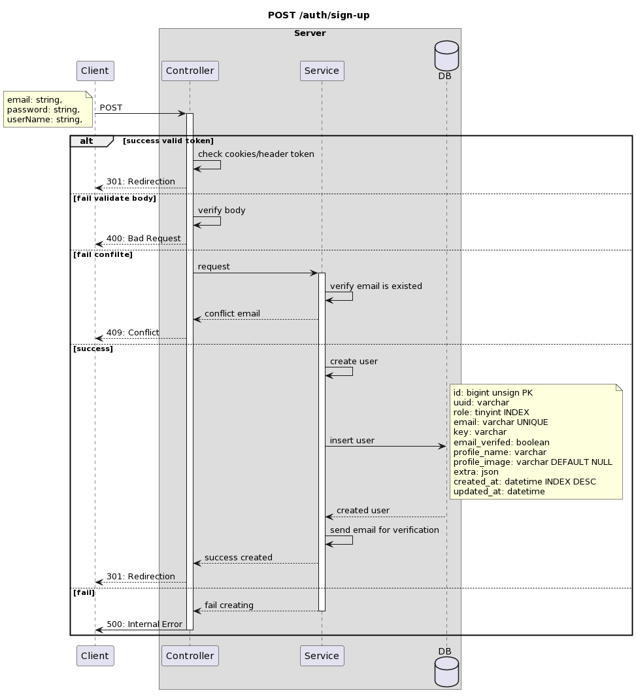
```plantuml-svg
title POST /auth/sign-up

participant Client as client
box "Server"
participant Controller as controller
participant Service as service
database DB as db
end box

client -> controller: POST
activate controller
	note left
		email: string,
		password: string,
		userName: string,
	end note
alt success valid token
	controller -> controller: check cookies/header token
	controller --> client : 301: Redirection
else fail validate body
	controller -> controller: verify body
	controller --> client: 400: Bad Request

else fail confilte
	controller -> service: request
activate service
	service -> service: verify email is existed
	service --> controller: conflict email
	controller --> client: 409: Conflict
else success
	service -> service: create user
	service -> db : insert user
		note right
			id: bigint unsign PK
			uuid: varchar
			role: tinyint INDEX
			email: varchar UNIQUE
			key: varchar
			email_verifed: boolean
			profile_name: varchar
			profile_image: varchar DEFAULT NULL
			extra: json
			created_at: datetime INDEX DESC
			updated_at: datetime
		end note
	db --> service: created user
	service -> service: send email for verification
	service --> controller: success created
	controller --> client: 301: Redirection
else fail
	service --> controller: fail creating
	deactivate service
	controller -> client: 500: Internal Error
	deactivate controller
end
```
### POST /auth/resend-verification-email
#### request
```ts
type RequestAuthResendVerificationEmailBody = {
	email: string;
}
```
#### response
```ts
type ResponseAuthResendVerificationEmailBody = {
	message: string
}
```
#### diagram
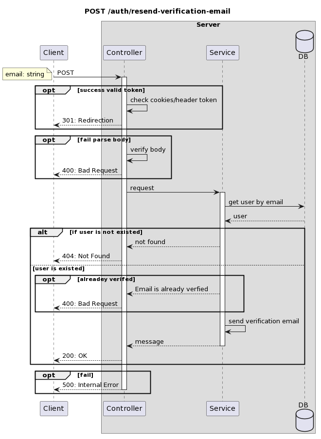
```plantuml-svg
title POST /auth/resend-verification-email

participant Client as client
box "Server"
participant Controller as controller
participant Service as service
database DB as db
end box

client -> controller: POST
	note left
		email: string
	end note
	activate controller

opt success valid token
	controller -> controller: check cookies/header token
	controller --> client : 301: Redirection
end

opt fail parse body
	controller -> controller: verify body
	controller --> client: 400: Bad Request
end

controller -> service: request
activate service
service -> db: get user by email
db --> service: user

alt if user is not existed
	service --> controller: not found
	controller --> client: 404: Not Found
else user is existed
	opt alreadey verifed
		service --> controller: Email is already verfied
		controller --> client: 400: Bad Request
	end
	service -> service: send verification email
	service --> controller: message
	deactivate service
	controller --> client: 200: OK
end		
opt fail
	controller --> client: 500: Internal Error
	deactivate controller
end
```
### GET /auth/verify-access-token
#### request 
```ts
type RequestVerifyAccessTokenCookies = {
	"accessToken": token
}
```
#### response
```ts
type ReponseVerifyAccessTokenBody = {
	role: number;
}
```
#### diagram
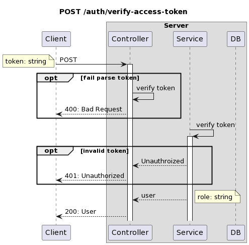
```plantuml-svg
title POST /auth/verify-access-token

participant Client as client
box "Server"
participant Controller as controller
participant Service as service
participant DB as db
end box

client -> controller: POST
	note left
		token: string
	end note
	activate controller

opt fail parse token
	controller -> controller: verify token
	controller --> client: 400: Bad Request
end

service -> service: verify token
activate service

opt invalid token
	service --> controller: Unauthroized
	controller --> client: 401: Unauthorized
end

service --> controller: user
	note right
		role: string
	end note
controller --> client: 200: User	
```
### GET /auth/refresh-access-token
#### request 
```ts
type RequestRefreshAccessTokenCookies = {
	"refreshToken": token
}
```
#### diagram
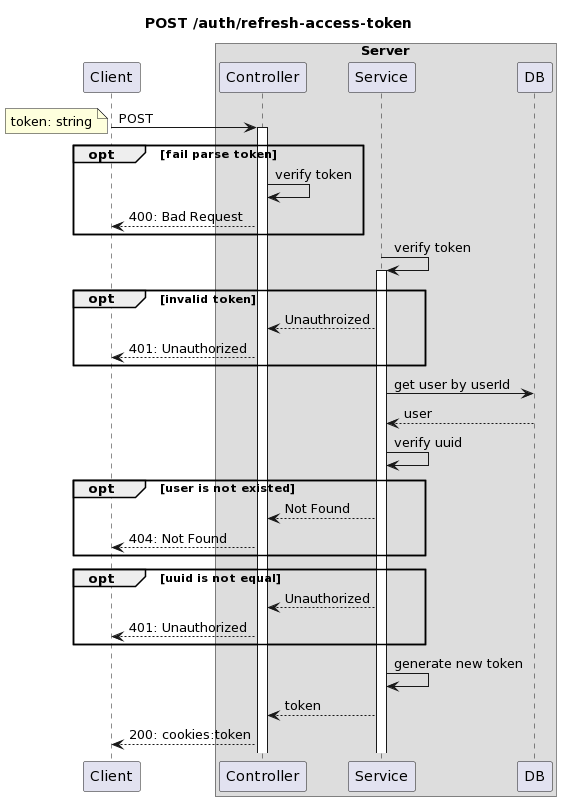
```plantuml-svg
title POST /auth/refresh-access-token

participant Client as client
box "Server"
participant Controller as controller
participant Service as service
participant DB as db
end box

client -> controller: POST
	note left
		token: string
	end note
	activate controller

opt fail parse token
	controller -> controller: verify token
	controller --> client: 400: Bad Request
end

service -> service: verify token
activate service

opt invalid token
	service --> controller: Unauthroized
	controller --> client: 401: Unauthorized
end

service -> db: get user by userId
db --> service: user
service -> service: verify uuid

opt user is not existed
	service --> controller: Not Found
	controller --> client: 404: Not Found
end

opt uuid is not equal
	service --> controller: Unauthorized
	controller --> client: 401: Unauthorized
end

service -> service: generate new token
service --> controller: token
controller --> client: 200: cookies:token
```
### GET /auth/verify-email
#### request
```ts
type Token = {
	paylod: {
		email:string,
		uuid:string,
		exp:number,
	}
}
type RequestAuthVerifyEmailParams = {
	token: Token;
}
```
#### diagram
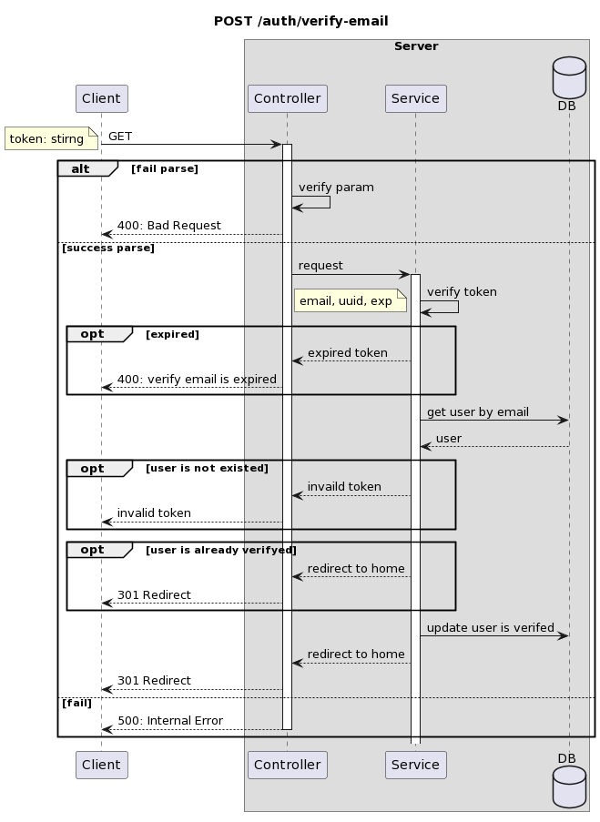
```plantuml-svg
title POST /auth/verify-email

participant Client as client
box "Server"
participant Controller as controller
participant Service as service
database DB as db
end box

client -> controller: GET
	note left
		token: stirng
	end note
	activate controller

alt fail parse
	controller -> controller: verify param
	controller --> client: 400: Bad Request
else success parse
	controller -> service: request
	activate service
	service -> service: verify token
	note left
		email, uuid, exp
	end note
	
	opt expired
		service --> controller: expired token
		controller --> client: 400: verify email is expired
	end
	
	service -> db: get user by email
	db --> service: user
	
	opt user is not existed
		service --> controller: invaild token
		controller --> client: invalid token
	end
	
	opt user is already verifyed
		service --> controller: redirect to home
		controller --> client: 301 Redirect
	end

	service -> db: update user is verifed
	service --> controller: redirect to home
	controller --> client: 301 Redirect 

else fail
	controller --> client: 500: Internal Error
	deactivate controller
end
```
### POST /auth/sign-in
#### request
```ts
type RequestAuthSignInBody = {
	email: string,
	password: string,
}
```
#### response 
```ts
type Token = {
	payload: {
		id: string,
		role: number,
		uuid: string,
		exp: number,
	},
}
type AuthSignInRsponseHeaders = {
	"Set-Cookie": AccessToken,
	"Set-Cookie": RefreshToken,
}
```
#### diagram
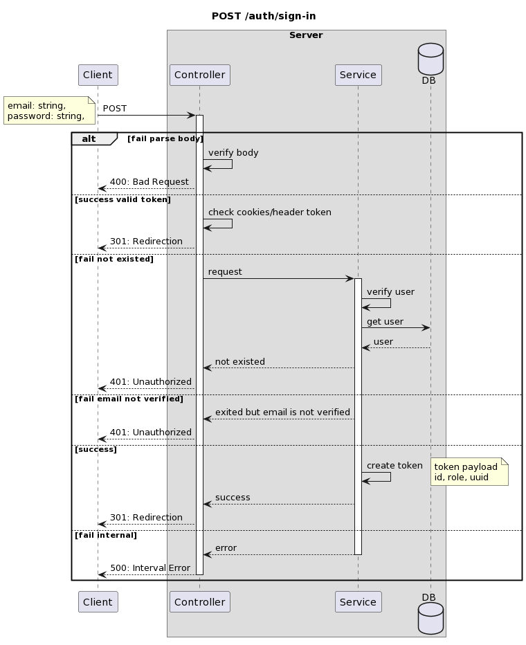
```plantuml-svg
title POST /auth/sign-in

participant Client as client
box "Server"
participant Controller as controller
participant Service as service
database DB as db
end box
	
client -> controller: POST
activate controller
	note left
	email: string,
	password: string,
	end note
alt fail parse body
	controller -> controller: verify body
	controller --> client : 400: Bad Request
else success valid token
	controller -> controller: check cookies/header token
	controller --> client : 301: Redirection
else fail not existed
	controller -> service: request
	activate service
	service -> service: verify user
	service -> db: get user
	db --> service: user
	service --> controller: not existed
	controller --> client: 401: Unauthorized
else fail email not verified
	service --> controller: exited but email is not verified
	controller --> client: 401: Unauthorized
else success 
	service -> service: create token
		note right
		token payload
		id, role, uuid
		end note
	service --> controller: success
	controller --> client: 301: Redirection
else fail internal
	service --> controller: error
	deactivate service
	controller --> client: 500: Interval Error
	deactivate controller
end
```
### POST /auth/find-password
#### request
```ts
type authFindPasswordRequest = {
	email: string;
}
```
#### reponse
```ts
type findPasswordResponse = {
	message: string;
}
```
#### diagram
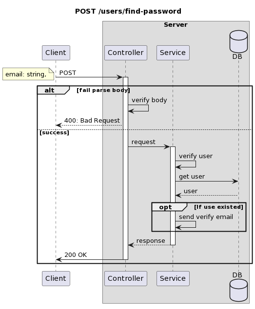
```plantuml-svg
title POST /users/find-password

participant Client as client
box "Server"
participant Controller as controller
participant Service as service
database DB as db
end box

client -> controller: POST
activate controller
	note left
	email: string,
	end note
alt fail parse body
	controller -> controller: verify body
	controller --> client : 400: Bad Request
else success
	controller -> service: request
	activate service
	service -> service: verify user
	service -> db: get user
	db --> service: user
		opt If use existed
		service -> service: send verify email
		end
	service --> controller: response
	deactivate service
	controller -> client: 200 OK
	deactivate controller
end
```
## /me
### PATCH /me/profile
#### request
```ts
type MeEditProfileRequest = {
	userName: string,
	extra: {
		//...
	}
}
```
#### diagram
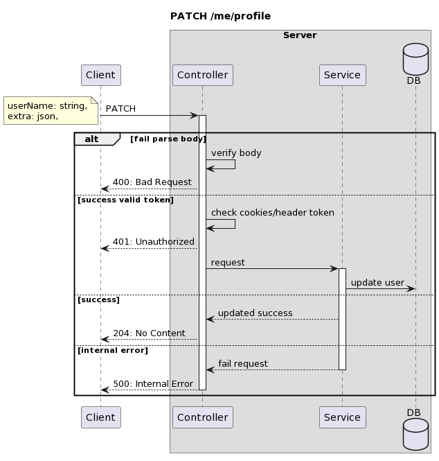
```plantuml-svg
title PATCH /me/profile

participant Client as client
box "Server"
participant Controller as controller
participant Service as service
database DB as db
end box

client -> controller: PATCH
activate controller
	note left
	userName: string,
	extra: json,
	end note
alt fail parse body
	controller -> controller: verify body
	controller --> client: 400: Bad Request
else success valid token
	controller -> controller: check cookies/header token
	controller --> client: 401: Unauthorized
	controller -> service: request
	activate service
	service -> db: update user
else success
	service --> controller: updated success
	controller --> client: 204: No Content
else internal error
	service --> controller: fail request
	deactivate service
	controller --> client: 500: Internal Error
	deactivate controller
end
```
### GET /me/enrolls?
#### request
```ts
type getMeEnrollsQueryRequest = {
	cursor?: number,
	order?: "study" | "enroll"
	search?: string,
}
```
#### reponse
```ts
type Enroll = {
	cousre_id: number,
	progress: {
		//..
	},
	createdAt: string,
	updatedAt: string,
}
type Course = {
	id: number,
	title: string,
	video_id: string,
	enroll: Enroll
}
type getUserEnrollsQueryReponse = {
	courses: Course[]
}
```
#### diagram
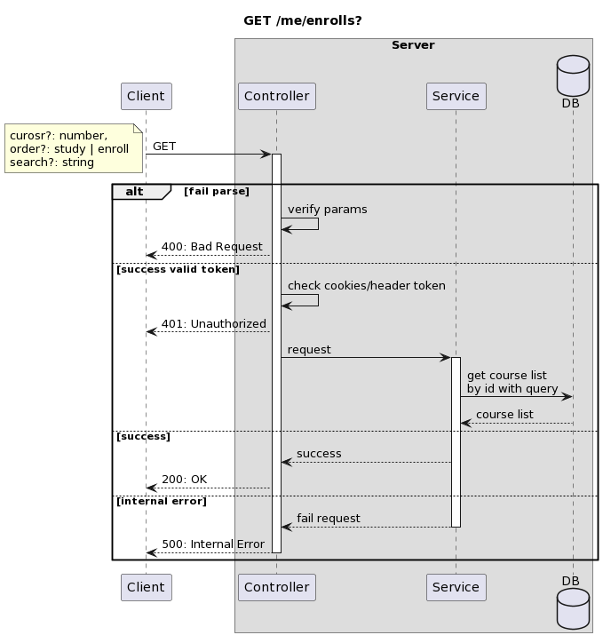
```plantuml-svg
title GET /me/enrolls?

participant Client as client
box "Server"
participant Controller as controller
participant Service as service
database DB as db
end box

client -> controller: GET
activate controller
	note left
	curosr?: number,
	order?: study | enroll
	search?: string
	end note
alt fail parse
	controller -> controller: verify params
	controller --> client: 400: Bad Request
else success valid token
	controller -> controller: check cookies/header token
	controller --> client: 401: Unauthorized
	controller -> service: request
	activate service
	service -> db: get course list\nby id with query
	db --> service: course list
else success
	service --> controller: success
	controller --> client: 200: OK
else internal error
	service --> controller: fail request
	deactivate service
	controller --> client: 500: Internal Error
	deactivate controller
end
```
### GET /me/enrolls/courses/:curseId
#### request
```ts
type getMeEnrollByCourseIdRequest = {
	user_id: number
	course_id: number
}
```
#### reponse
```ts
type Enroll = {
	course_id: number,
	progress: {
		//...
	},
	createdAt: string,
	updatedAt: string,
	course: Course,
}
type getMeEnrollByCourseIdReponse = Enroll
```
#### diagram
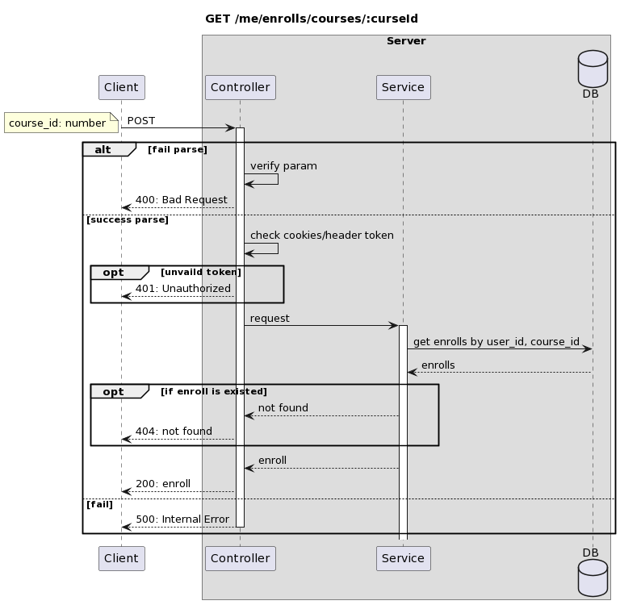
```plantuml-svg
title GET /me/enrolls/courses/:curseId

participant Client as client
box "Server"
participant Controller as controller
participant Service as service
database DB as db
end box

client -> controller: POST
	note left
		course_id: number
	end note
	activate controller

alt fail parse
	controller -> controller: verify param
	controller --> client: 400: Bad Request
else success parse
	controller -> controller: check cookies/header token
	
	opt unvaild token
		controller --> client: 401: Unauthorized
	end
	
	controller -> service: request
	activate service
	
	service -> db: get enrolls by user_id, course_id
	db --> service: enrolls

	opt if enroll is existed
		service --> controller: not found
		controller --> client: 404: not found
	end
	service --> controller: enroll
	controller --> client: 200: enroll
else fail
	controller --> client: 500: Internal Error
	deactivate controller
end
```
### POST /me/enrolls
#### request
```ts
type createMeEnrollRequest = {
	courseId: number,
	userId: number,
}
```
#### diagram
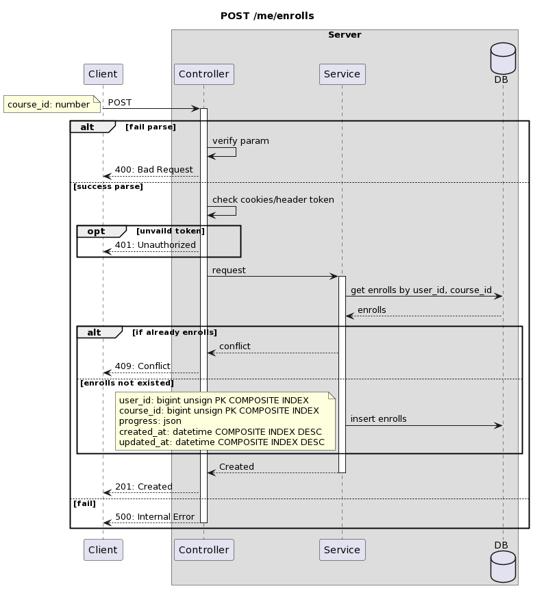
```plantuml-svg
title POST /me/enrolls

participant Client as client
box "Server"
participant Controller as controller
participant Service as service
database DB as db
end box

client -> controller: POST
	note left
		course_id: number
	end note
	activate controller

alt fail parse
	controller -> controller: verify param
	controller --> client: 400: Bad Request
else success parse
	controller -> controller: check cookies/header token
	
	opt unvaild token
		controller --> client: 401: Unauthorized
	end
	
	controller -> service: request
	activate service
	
	service -> db: get enrolls by user_id, course_id
	db --> service: enrolls

	alt if already enrolls
		service --> controller: conflict
		controller --> client: 409: Conflict
	else enrolls not existed
		service -> db: insert enrolls
			note left
				user_id: bigint unsign PK COMPOSITE INDEX
				course_id: bigint unsign PK COMPOSITE INDEX
				progress: json
				created_at: datetime COMPOSITE INDEX DESC
				updated_at: datetime COMPOSITE INDEX DESC
			end note
	end
	service --> controller: Created
	deactivate service
	controller --> client: 201: Created
else fail
	controller --> client: 500: Internal Error
	deactivate controller
end
```
## /courses
### GET /courses/:id/:slug
#### request
```ts
type getCoursesByIdRequest = {
	id: string;
}
```
#### response
```ts
type getCoursesByIdResponse = {
	id: number,
	video_id: string,
	channel_id: string,
	category_id: number,
	laguage: string,
	title: string,
	description: string,
	chapters: string,
	enrollCount: number,
	extra: any,
	channel: {
		id: string,
		name: string,
	},
	updatedAt: Date,
	createdAt: Date
	enroll: {
		id: number,
		progress: number,
	},
	category: {
		id: number,
		name: string
	}
};
```
#### diagram
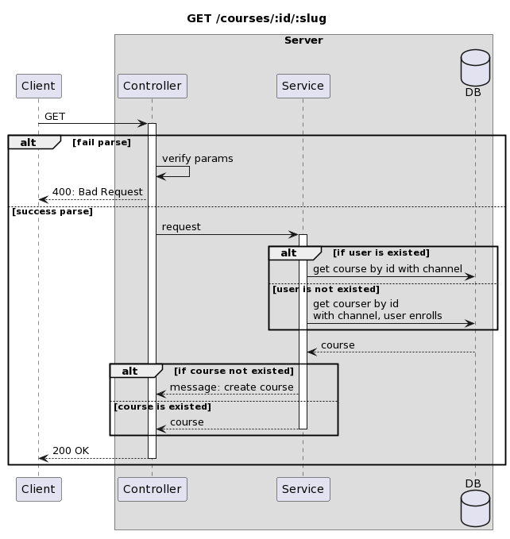
```plantuml-svg
title GET /courses/:id/:slug

participant Client as client
box "Server"
participant Controller as controller
participant Service as service
database DB as db
end box

client -> controller: GET
activate controller

alt fail parse
	controller -> controller: verify params
	controller --> client: 400: Bad Request
else success parse
	controller -> service: request
	activate service
	alt if user is existed
		service -> db: get course by id with channel
	else user is not existed
		service -> db: get courser by id\nwith channel, user enrolls
	end
	db --> service: course
	alt if course not existed
		service --> controller: message: create course
	else course is existed
		service --> controller: course
	deactivate service
	end
controller --> client: 200 OK
deactivate controller
end
```
### POST /courses
#### request
```ts
type createCourseRequest = {
	url: string,
}
```
#### diagram
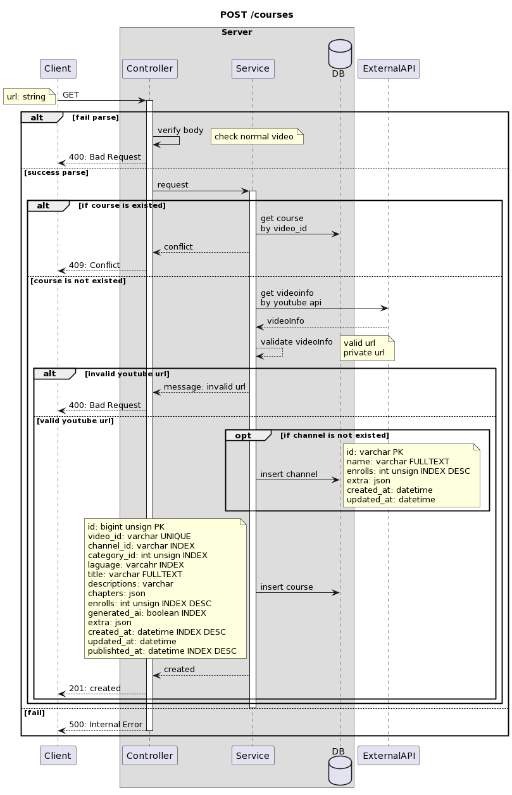
```plantuml-svg
title POST /courses

participant Client as client
box "Server"
participant Controller as controller
participant Service as service
database DB as db
end box
participant ExternalAPI as external

client -> controller: GET
	note left
		url: string
	end note
	activate controller

alt fail parse
	controller -> controller: verify body
		note right
		check normal video
		end note
	controller --> client: 400: Bad Request
else success parse
	controller -> service: request
	activate service
	alt if course is existed
		service -> db: get course\nby video_id
		service --> controller: conflict
		controller --> client: 409: Conflict
	else course is not existed
		service -> external: get videoinfo\nby youtube api
		external --> service: videoInfo
		service --> service: validate videoInfo
			note right
				valid url
				private url
			end note
			alt invalid youtube url
				service --> controller: message: invalid url
				controller --> client: 400: Bad Request
			else valid youtube url
				opt if channel is not existed
					service -> db: insert channel
						note right
							id: varchar PK
							name: varchar FULLTEXT
							enrolls: int unsign INDEX DESC
							extra: json 
							created_at: datetime
							updated_at: datetime
						end note
				end
				service -> db: insert course
					note left
						id: bigint unsign PK
						video_id: varchar UNIQUE
						channel_id: varchar INDEX
						category_id: int unsign INDEX
						laguage: varcahr INDEX
						title: varchar FULLTEXT
						descriptions: varchar
						chapters: json
						enrolls: int unsign INDEX DESC
						generated_ai: boolean INDEX
						extra: json
						created_at: datetime INDEX DESC
						updated_at: datetime
						publishted_at: datetime INDEX DESC
					end note
				service --> controller: created
				controller --> client: 201: created
			end
	end
	deactivate service
else fail
	controller --> client: 500: Internal Error
	deactivate controller
end
```
### GET /courses?
#### request
```ts
type getCoursesQueryRequest = {
	cursor?: number,
	categoryId?: number,
	order?: popular | recent
	videoId?: string,
	search?: string,
	channelId?: string,
}
```
#### reponse
```ts
type Course = {
	id: number,
	video_id: string,
	channel_id: string,
	laguage_id: string,
	title: string,
	enrolls: number,
	channel: {
		id: string,
		name: string,
	},
	enroll: {
		id: number,
		progress: any,
	}
}

type getCoursesQueryReponse = {
	courses: Course[]
}
```
#### diagram
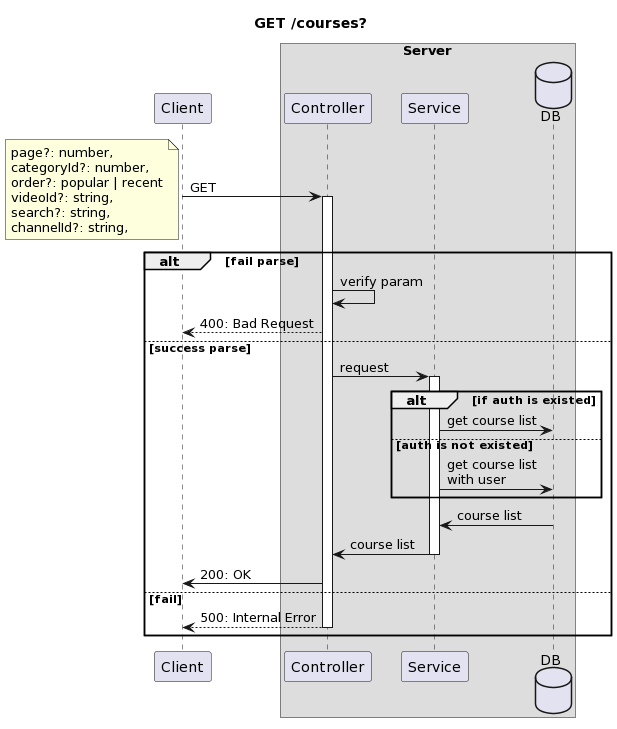
```plantuml-svg
title GET /courses?

participant Client as client
box "Server"
participant Controller as controller
participant Service as service
database DB as db
end box

client -> controller: GET
	note left
		page?: number,
		categoryId?: number,
		order?: popular | recent
		videoId?: string,
		search?: string,
		channelId?: string,
	end note
	activate controller

alt fail parse
	controller -> controller: verify param
	controller --> client: 400: Bad Request
else success parse
	controller -> service: request
	activate service
	alt if auth is existed
		service -> db: get course list
	else auth is not existed
		service -> db: get course list\nwith user
	end
	db -> service: course list
	service -> controller: course list
	deactivate service
	controller -> client: 200: OK
else fail
	controller --> client: 500: Internal Error
	deactivate controller
end
```

## /channels
### GET /channels/:id
#### request
```ts
type getChannelByIdRequest = {
	id: string,
}
```
#### response
```ts
type getChannelByIdReponse = {
	id: string,
	name: string,
	enrolls: number,
	extra: any,
}
```
#### diagram

```plantuml-svg
title POST /channels/:id

participant Client as client
box "Server"
participant Controller as controller
participant Service as service
database DB as db
end box

client -> controller: GET
	note left
		id: string
	end note
	activate controller

alt fail parse
	controller -> controller: verify param
	controller --> client: 400: Bad Request
else success parse
	controller -> service: request
	activate service
	service -> db: get channel by id
	db --> service: channel
	alt if channel is not existed
		service --> controller: not found
		controller --> client: 404: Not Found
	else channel is existed
		service --> controller: channel
		deactivate service
		controller --> client: 200: OK
	end
else fail
	controller --> client: 500: Internal Error
	deactivate controller
end
```

## /admin
### /users
#### GET /admin/users/statics
#### GET /admin/users?
#### GET /admin/users/:id
#### PATCH /admin/users/:id
#### DELETE /admin/users/:id
### /courses
#### GET /admin/courses/statics
#### GET /admin/courses?
#### GET /admin/courses/:id
#### PATCH /admin/courses/:id
#### DELETE /admin/courses/:id
### /channels
#### GET /admin/channels/statics
#### GET /admin/channels?
#### GET /admin/channels/:id
#### PATCH /admin/channels/:id
#### DELETE /admin/channels/:id
### /categorys
#### GET /admin/categorys?
#### GET /admin/categorys/:id
#### PATCH /admin/categorys/:id
#### DELETE /admin/categorys/:id
### /roles
#### GET /admin/roles?
#### GET /admin/roles/:id
#### PATCH /admin/roles/:id
#### DELETE /admin/roles/:id 
